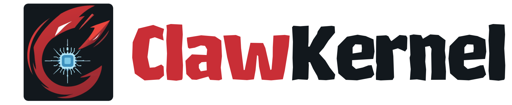

# ClawKernel
<div align="center">



**Mission Control & Automation Dashboard for [OpenClaw](https://github.com/openclaw/openclaw)**

[](https://www.npmjs.com/package/clawkernel)
[](https://www.typescriptlang.org)
[](https://react.dev)
[](./LICENSE)

</div>

---

**ClawKernel** is a Mission Control & Automation Dashboard for your OpenClaw Gateway — manage AI agents, automate cron jobs, monitor live sessions, stream real-time chat, and track events from a single interface. No extra backend required.

## Quick Start

```bash
npx clawkernel
```

Or install globally:

```bash
npm install -g clawkernel
clawkernel
```

The first run launches a setup wizard to configure your Gateway URL and token.
Config is saved to `~/.clawkernel.json` — run `clawkernel --reset` to reconfigure.

## How It Works

ClawKernel connects to your **OpenClaw Gateway** over a persistent WebSocket connection. All data flows through that connection — no separate backend needed.

```
+------------------+                         +----------------------+
|   ClawKernel     |<--- WebSocket --------->|  OpenClaw Gateway    |
|   Browser UI     |   ws://localhost:18789  |  AI Agent Runtime    |
+------------------+                         +----------------------+
```

## Features

- 🤖 **Agents** — create, configure, clone, and monitor agents
- 💬 **Chat** — real-time streaming chat with full message history
- 📋 **Sessions** — browse and manage all active sessions
- ⏰ **Cron** — schedule and track recurring jobs
- 📊 **Dashboard** — live gateway metrics at a glance

## Development

```bash
git clone https://github.com/Saleh7/clawkernel
cd clawkernel
npm install
cp .env.example .env   # set VITE_GATEWAY_URL and VITE_GATEWAY_TOKEN
npm run dev
```

Open [http://localhost:5173](http://localhost:5173)

### Environment Variables

| Variable | Default | Description |
|---|---|---|
| `VITE_GATEWAY_URL` | `ws://localhost:18789` | OpenClaw Gateway WebSocket URL |
| `VITE_GATEWAY_TOKEN` | — | Gateway authentication token |
| `VITE_OPENCLAW_HOME` | `~/.openclaw` | OpenClaw home directory |

## Stack

React 19 · TypeScript (strict) · Vite 7 · Tailwind CSS v4 · Zustand · shadcn/ui · Biome

## License

MIT © [Saleh](https://github.com/Saleh7)
